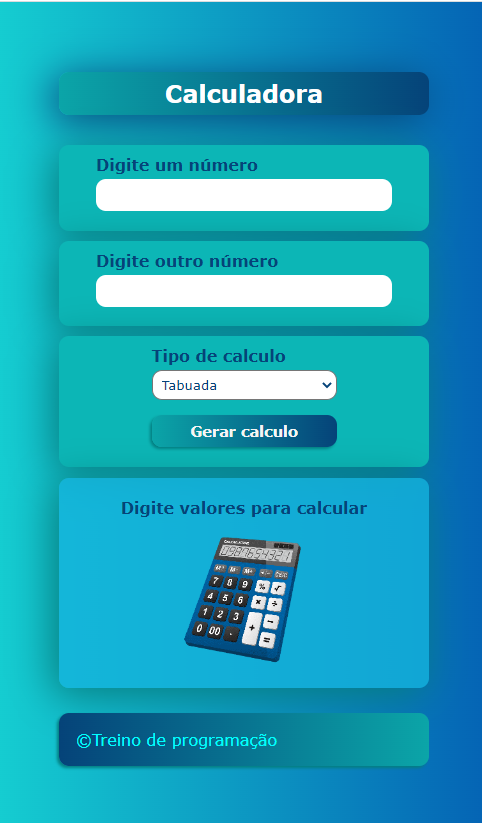
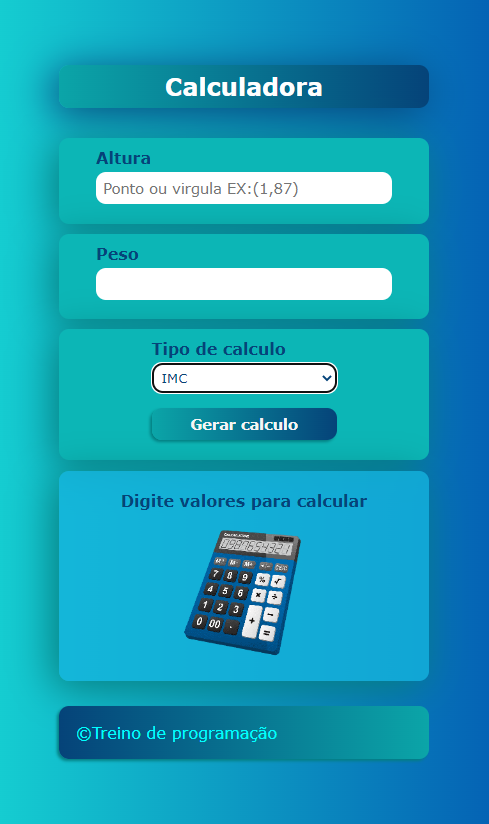
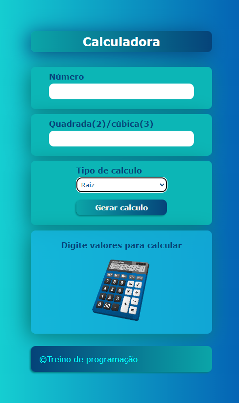

Uma calculadora diferente da tradicional que gera também uma lista de tabuada , medi o indice de massa corporia (IMC) e converte dolar e euro em reais ,  em breve adicionarei mais funcionalidades
além das funcionalidades de subtração , somar , multiplicação e divisão 

esta é página online https://alex-777-90.github.io/Calculadora/

  

Calculadora IMC
 
  
Calculadora conversor de moeda
 
  
Calculadora Raiz
 

