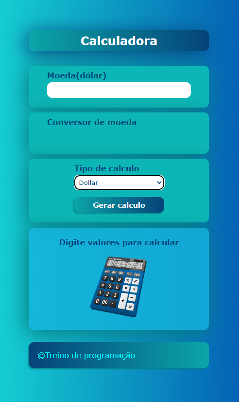

Uma calculadora diferente da tradicional que gera também uma lista de tabuada , medi o indice de massa corporia (IMC) e converte dolar e euro em reais através do consumo de uma API pelo fetchAPI,  em breve adicionarei mais funcionalidades
além das funcionalidades de subtração , somar , multiplicação e divisão 

esta é página online https://alex-777-90.github.io/Calculadora/

  

<h2>Calculadora IMC </h2>
 
  
<h2>Calculadora conversor de moeda</h2>
 
  
<h2>Calculadora Raiz</h2>
 

